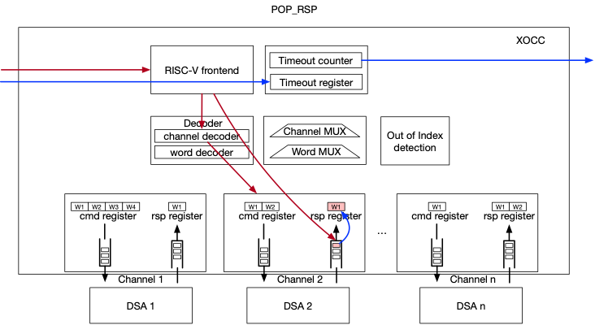

# Introduction
The heterogenous system-on-chip (SoC) architectures which combine multiple processor cores and specialized hardware accelerators have emerged as a feasible solution to achieve energy and performance efficiency in the face of the slowdown of Moore's Law and the end of Dennard's scaling. 

Massive Domain-specific-architectures are proposed to accelerate the process of specific applications. However, accelerator-only designs lack programmability. Traditional loosely integrated with MMIO (Memory-Mapped I/O) provides coarse-grained programmability and have relatively high communication latency (~100 cycle). Tightly coupled DSAs which are integrated into processor pipeline can achieve good programmability. But it needs specialized hardware and software (e.g. toolchain) solutions, which lacks flexibility when exploring.

This project proposes a queue-based RISC-V coprocessor communication hub (as we also called eXtensible On-chip Co-processor Communication, XoCC) to connect customized hardware with RISC-V instruction extension. XoCC provides a fairly fast interaction speed, which consists of the instruction latency to fill the queue, and the accelerator’s latency to read the queue (∼10 cycles depending on queue width and accelerator design) cycles. Second, it provides decent programmability leveraging the instruction extension and fine-grained control commands. Third, it is easy to extend to various accelerators, since the extended instructions and its corresponding toolchain modifications are independent of the queues and accelerators.

This repository contains the XoCC Extension of RISC-V processor, as well as the SoC platform for validation and FPGA prototyping.  

# Features
XoCC is an interface module that is in charge of task (uOP/intrinsic) offloading and response collection between a RISC-V core and its coprocessors (accelerator). 
To be more specific, the XoCC is a queue-based communication hub between RISC-V and coprocessors that passes information to targeted coprocessor and collect response from them. 
The information passed to the coprocessor can serve as coprocessor command and/or operands, and the responses from coprocessor can be interpreted as result or status. 

In particular, the XoCC composes the information from RISC-V GPRs, pushes information (also called accelerator instruction) to outbound queues, pops response from inbound queues, decomposes the response message and put result onto RISC-V GPRs. During this period, XoCC also checks queue status like empty or full before they can perform a push or pop operation. 

The aforementioned functionality of XoCC module is achieved by extending a few custom instructions, called XoCC instructions, into RISC-V instruction set. The XoCC module is tightly coupled with the RISC-V core, integrated into its execution pipeline, and controlled by RISC-V instructions.
The XoCC interface concept can be extended to any two modules that support XoCC extensions, for example, a XoCC interface between RISC-V and RISC-V to support information transfer.

The features of XoCC are summarized as follows:
1. XoCC supports a variable number of coprocessors, each connected with XoCC by two queues, command queue and response queue.
2. XoCC supports the interface connection between RISC-V and RISC-V.
3. XoCC supports queues with variable lengths and depths. Each queue, command or response queue, corresponding to any coprocessor, can have independent queue configuration.
4. The XoCC instruction extentions are independent from coprocessors. They focus on the queue management instructions which is universal to different coprocessors. 
  * XoCC instructions are extended from RISC-V instruction set.
  * The coprocessor commands/responses do not affect RISC-V instruction set. 
  * The coprocessor commands/responses do not affect XoCC instruction extensions.
  * The coprocessor commands/responses are built upon XoCC framework, which is software programmable on top of XoCC instructions.
5. Since the implementation of XoCC involves instantiation of physical queues (FIFOs), the decision should be made at hardware design time. 

To sum up, RISC-V with XoCC instruction extension creates a flexible coprocessor extension framework. Any coprocessor, as long as it follows XoCC queue-based interface, can hook to RISC-V with direct support from RISC-V, without impact on RISC-V toolchain and implementation. The communication with the added coprocessor is achieved purely by software. The communication with coprocessor can be fine-grained as frequent as once every cycle or every a few cycles. 

# XoCC Instruction Extension
XoCC extension includes six instructions:  
* WRITE_CMD
* READ_RSP
* PUSH_CMD
* POP_RSP
* PUSH_RDY
* POP_RDY

## Opcode
The XOCC extends the RISC-V instruction set. The opcode is selected based on the criteria that it does not conflict with existing or reserved opcode. According to the RISC-V spec 2.2, the opcode has 7 bits, and its opcode map is:   

The opcode for XOCC is custom-0: inst[6:5] = 00, inst[4:2] = 010, inst[1:0] = 11. That is, inst[6:0] = 0001011.  

## Instructions
As discussed in previous section, the needed operations for XOCC can be summarized as the following 6 instructions:   

It can be observed that to accommodate such 6 instructions, it is favorable to use I-type RISC-V encoding format.   
* Funct3 can accommodate 6 instructions
* Reusing a current encoding format type minimizes hardware instruction decoder complexity
* The coprocessor index and word index can, and often need to, be determined before compile time, thus can be encoded as immediate numbers.

### PUSH_CMD
PUSH_CMD instruction data and control pah
* Function: The XOCC_PUSH_CMD instruction pushes the cmd register content of selected channel into a queue with same width. 
* Input: immediate number bits are used to select queue/channel. RS1 is used to indicate how many cycles the instruction will stall before the queue to push becomes available (not full). If the push is stalled for RS1 number of cycles, the module will output false. When RS1 is addressed to x0 (zero constant), the PUSH will not stall.
* Output: a status indicating if push is successful.   


### POP_RSP
POP_RSP instruction data and control path
* Function: The XOCC_POP_RSP instruction pops the response queue and put the content on the rsp registers on selected channel.
* Input: immediate number bits are used to select queue/channel. RS1 is used to indicate how many cycles the instruction will stall before the queue to pop becomes available (not empty). If the pop is stalled for RS1 number of cycles, the module will output false. When RS1 is addressed to x0 (zero constant), the POP will not stall the instruction pipeline.
* Output: a status indicating if pop is successful.   


### WRITE_CMD
WRITE_CMD instruction data and control path
* Function: The XOCC_WRITE_CMD instruction writes data into the selected word of the cmd registers of the selected channel.
* Input: immediate number bits are used to select queue/channel and word of cmd registers. RS1 is the data to write, which comes from the GPR.
* Output: a status indicating if pop is successful.   


### READ_RSP
READ_RSP instruction data and control path
* Function: The XOCC_READ_RSP instruction reads data from the selected word of the rsp registers of the selected channel.
* Input: immediate number bits are used to select queue/channel and word of rsp registers. 
* Output: the readout word.    


### PUSH_RDY
PUSH_RDY instruction data and control path
* Function: The XOCC_PUSH_RDY instruction pulls the status of cmd queue full signal of the selected channel.
* Input: immediate number bits are used to select queue/channel. 
* Output: status if the selected queue can perform push operation.    


### POP_RDY
POP_RDY instruction data and control path
* Function: The XOCC_POP_RDY instruction pulls the status of rsp queue empty signal of the selected channel.
* Input: immediate number bits are used to select queue/channel. 
* Output: status if the selected queue can perform pop operation.   


# Architecture
We provided a SoC platform to demonstrate the functionality of XoCC.
As illustrated below, the SoC consists of the RISC-V cluster with three cores, three DSAs module, and memory subsystem.
In this example, each RISC-V core connects with a DSA via XoCC. RV 0 can also interact with RV 1 and RV 2 through XoCC. 
RV 0 plays the role of main controller and RV 0 and RV 1 are mainly responsible for issuing instructions to DSAs.   
 
# File structure
- design: design rtl code  
    * src_rtl: source code (verilog (.v/.sv/.h)

- dv: verification environment
    * script: scripts for simulation
    * tb: testbench
    * testcase: basic smoke testcase
    * workdir: work directory for simulation

- sw: provide hardware-related files for software development
    * lib  
        * asm_lib 
            * inc: include header files
            * src: source files
        * clib: basic c function
    * kernel: dsa function

# Steps
## Prerequisites
**Python**
To run testcases, we need **Python3** to generate some simulation files.

**EDA tools**
Our simulation flow is based on **Synopsys VCS** EDA tools, you have to setup some environment variables before start. You can add them at the bottom of sourceme.csh.

**Toolchain**
The gcc compiler can be acquired [here](https:////), which has integreated our customized instruction extension in official compiler. 
After that, you need to add it in sourceme.csh.
```shell
setenv TOOL_EXTENSION "[your local path]/bin"
```
## Run smoke test
Note: Make sure that you have finshed former steps.
 
```shell
#Run smoke test 
csh
cd RV-with-XoCC
source souceme.csh
run_case -t smoke_test
```
### Detailed usage for run_case

```shell
# --no_comp_c/-nc, --no_comp_rtl/-nr, --nosim/-ns   
run_case -t smoke_test --nosim --no_comp_c      #when you want to recompile rtl after rtl files modified without recompiling .c and simulation  
run_case -t smoke_test --nosim --no_comp_rtl    #when you want to recompile case or regenrate data with datagen without recompiling rtl and simultation
run_case -t smoke_test --no_comp_rtl            #when you want to rerun case without recompiling rtl  
  
# --opt, --update  
run_case --opt --update -t smoke_test           #when both --opt and --update used, default_workdir updates its simulation database
run_case --opt -t [any testcase]                      #when default_workdir has a compiled simulation database (which means --update has been used at least once), all cases can share it to run simulation without compiling rtl 
  
# --nodump  
run_case --opt -t smoke_test --nodump           #no fsdb generated, may speedup simulation 
```
# Write your testcase
The smoke testcase validates the XoCC datapath inside rv clusters (three rv core in our default desin), the XoCC connection between rv core and DSAs, and the memory accesses of all rv cores and DSAs. 

We provide some XoCC APIs and DSA kernel templates for writing testcases, which can be found in below files.
> sw/kernel/inc/qid.h
> sw/kernel/inc/XoCC_asm.h
> sw/kernel/inc/dsa.h

## Queue ID
The qid defined in qid.h refers to the XoCC channel number of a XoCC-extended RV core. For example, RV 0 in our default architecture has three XoCC channels, which connects DSA0, RV 1, and RV2. 

As you can see in [arhictecture](#architecture), the XoCC channels (which depicted with blue) are labled with numbers, which are exactly the QID. 
The QID in this example is labled as 0/1/2. Certainly, you can use other numbers, but they must match the hardware design.

One notable thing is that the RV 1 and RV 2 use one channel (labled as 0) interacting with RV 0 and they have only two channels, hence only one DSA can be connected.
## XoCC APIs
Functions defined in **XoCC_asm.h** correspond to the six XoCC instructions. We also packaged several functions for XoCC interaction.  
Here follows an example. _rv0_push_rv1_cmd_ refers to RV 0 transmiting command to RV 1. As you can see, a complete transmit flow includes three steps: WRITE_CMD, PUSH_RDY, and PUSH_CMD. 
```
static inline void rv0_push_rv1_cmd(unsigned int cmd){
    unsigned int result;
    unsigned int ready = 0;
    FUNC_WRITE_CMD(result, cmd, IMM12(00, RV_0_QID_0));     //CMD width: 32, one write_cmd required
    do { 
        FUNC_PUSH_RDY(ready, 0, IMM12(00, RV_0_QID_0)); 
    } while (!ready); 
    FUNC_PUSH_CMD(result, 0, IMM12(00, RV_0_QID_0));
}

static inline void rv0_push_dsa_cmd(unsigned int w1, unsigned int w2, unsigned int w3){
    unsigned int result; 
    unsigned int ready = 0; 
    FUNC_WRITE_CMD(result, w1, IMM12(00, RV_0_QID_2));  //CMD width:96, three write_cmd required
    FUNC_WRITE_CMD(result, w2, IMM12(01, RV_0_QID_2)); 
    FUNC_WRITE_CMD(result, w3, IMM12(02, RV_0_QID_2)); 
    do { 
        FUNC_PUSH_RDY(ready, 0, IMM12(0, RV_0_QID_2)); 
    } while (!ready); 
    FUNC_PUSH_CMD(result, 0, IMM12(0, RV_0_QID_2));
}
```
You may notice that for command width larger than 32, more WRITE_CMDs are required.

# Use your RV core
To integrate customized RISC-V CPU, modification on interfaces including XoCC (for XoCC interconnection) and AXI (for system bus) are required.  
**1. Integrate XoCC into your RV core**  
Generally, the instruction extension of XoCC involoves modifications on instruction decoder unit (idu) and execution unit (iu).
You can follow the description in [Instrction](#instructions) to complete the extension.  
**2. Integrate System AXI Bus**  
We chooses AXI as communication protocol. Thus, RV core requires an AXI master interface to access memory. Commonly, a bridge should be implemented for system bus. In this example, we use an AHB2AXI bridge for XuanTie RV core connect to AXI interconnect.  
**3. Integrated into RV cluster**  
Instantiate the modified RV core into rv_*_wrapper.v (located in design/src_rtl/cpu/cpu_ss/system).  
**4. (optional)Generate GCC compiler to support XoCC extension**  
If your RV core doesn't have other customized instruction extension except XoCC, then the provided toolchain can be used (support IMACF). Otherwise, you need to regenerate gcc compiler according to the official procedure.  
# Use your DSA
The steps to integrate customized DSA are similar to that of RV core.   
**1. XoCC Commands Definition**  
First of all, the XoCC commands should be defined, which include request from RV and response to RV. It should be noticed that the XoCC commands width must keep up with the XoCC interface in RV side. The commands style can be either RISC or CISC.  
**2. Integrate XoCC Interface**  
DSA interacts with RV core with XoCC interface including a request channel and a response channel.  
**3. Integrated into system Bus**  
Similarly, the DSA uses AXI to interact with memory subsystem. The data bus width doesn't have to be the same with AXI xbar, the data width converter is added automatically as long as the axi xbar is properly configured (located at design/src_rtl/xbar/xbar_top.sv). But same data width is recommended.  

# LICENSE
This project is developed by Alibaba and licensed under the Apache License (Version 2.0). This product contains various third-party components under other open source licenses. 
See the NOTICE file for more information.
